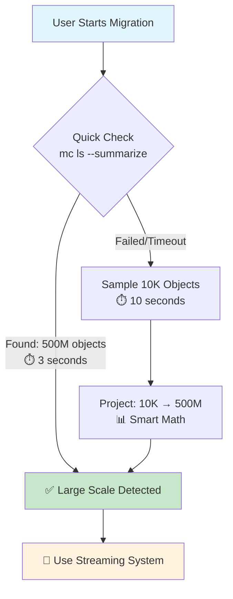
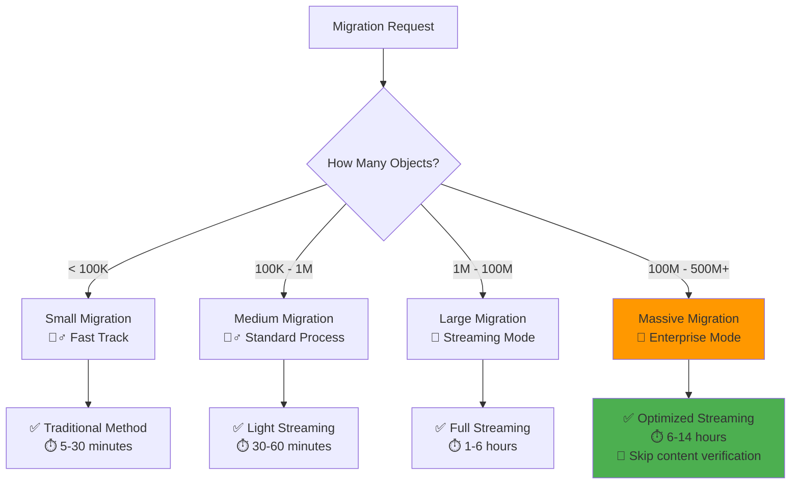

# 📊 Simple Diagrams: How to Handle 500 Million Objects

## 🎯 **Overview: Traditional vs New System**

```
❌ OLD SYSTEM (mc diff):
┌─────────────────────────────────────────────┐
│  Try to load 500M objects into memory       │
│  ↓                                          │
│  💥 CRASH! (Need 500GB+ RAM)                │
│  ❌ IMPOSSIBLE                              │
└─────────────────────────────────────────────┘

✅ NEW SYSTEM (Streaming):
┌─────────────────────────────────────────────┐
│  Process 10K objects at a time              │
│  ↓                                          │
│  Use only 200MB RAM constantly             │
│  ↓                                          │
│  ✅ SUCCESS in 6-14 hours                   │
└─────────────────────────────────────────────┘
```

---

## 🔍 **Step 1: How We Detect Large Migrations (1-15 seconds)**



**Simple Explanation:**
1. 🔍 Try quick count (3 seconds)
2. 📊 If that fails, sample small portion (10 seconds)  
3. 🧮 Calculate total: "If 10K objects found in 10 seconds, estimate 500M total"
4. ✅ Switch to powerful streaming system

---

## 🏭 **Step 2: Streaming Processing (The Magic!)**


**Simple Explanation:**
1. 📦 Split 500M objects into 50,000 small boxes (10K each)
2. 🔄 Process 4 boxes at the same time
3. 💾 Save results in database (not memory!)
4. ⚖️ Compare objects 5,000 at a time
5. 📋 Generate final report

---

## 🧠 **Memory Usage: Why It Works**

```
Traditional Method (IMPOSSIBLE):
┌─────────────────────────────────────────────┐
│  Object 1: source.jpg (metadata)            │
│  Object 2: data.pdf (metadata)              │
│  Object 3: video.mp4 (metadata)             │
│  ...                                        │
│  Object 500,000,000: huge.zip (metadata)    │
│  ⬆️ ALL LOADED AT ONCE = 500GB+ RAM         │
│  💥 SYSTEM CRASH                            │
└─────────────────────────────────────────────┘

New Streaming Method (SUCCESS):
┌─────────────────────────────────────────────┐
│  📦 Chunk 1: Objects 1-10,000               │
│     Process → Save to Database → Forget     │
│  📦 Chunk 2: Objects 10,001-20,000          │
│     Process → Save to Database → Forget     │
│  📦 Chunk 3: Objects 20,001-30,000          │
│     Process → Save to Database → Forget     │
│  ...                                        │
│  ⬆️ ONLY 200MB RAM ALWAYS                   │
│  ✅ NEVER CRASHES                           │
└─────────────────────────────────────────────┘
```

---

## ⏰ **Timeline: 500 Million Objects Migration**

```mermaid
gantt
    title 500M Objects Migration Timeline
    dateFormat X
    axisFormat %H:%M
    
    section Detection
    Smart Detection     :done, detect, 0, 15
    
    section Collection
    Source Inventory    :active, source, 15, 240
    Dest Inventory      :active, dest, 15, 240
    
    section Comparison
    Batch Processing    :compare, after source dest, 360
    
    section Report
    Generate Report     :report, after compare, 30
```



**Simple Timeline:**
- ⚡ **0-15 minutes**: Detect it's a large migration
- 📥 **15 minutes - 4 hours**: Collect list of all objects (both source & destination)
- ⚖️ **4-10 hours**: Compare objects in small batches
- 📋 **10+ hours**: Generate final report
- ✅ **Total**: 6-14 hours (vs IMPOSSIBLE with old system)

---

## 👥 **Multiple Users: Queue System**

```
Current System Status:
┌─────────────────────────────────────────────┐
│  🔄 Active Migrations: 3/5 slots used       │
│  🔄 Large Reconciliations: 3/3 slots used   │
│  ⚠️  SYSTEM AT CAPACITY                      │
└─────────────────────────────────────────────┘

When New User Requests 500M Migration:
┌─────────────────────────────────────────────┐
│  👤 User A: ✅ Running (50M objects)         │
│  👤 User B: ✅ Running (200M objects)        │
│  👤 User C: ✅ Running (1M objects)          │
│  👤 User D: 📋 Queued (500M objects)         │
│           ↳ Position: 1                     │
│           ↳ ETA: 2 hours                    │
│           ↳ Will start when User A finishes │
└─────────────────────────────────────────────┘
```

---

## 🎛️ **System Configuration for Different Sizes**



---

## 🔄 **Real-Time Progress for 500M Objects**

```
Migration Progress Dashboard:
┌─────────────────────────────────────────────┐
│  Migration: massive-500m-migration           │
│  Status: 🔄 Processing                       │
│                                             │
│  📊 Overall Progress: ████████░░ 80%         │
│                                             │
│  📥 Source Collection:   ████████████ 100%  │
│      ✅ 500,000,000 objects processed       │
│                                             │
│  📥 Dest Collection:     ████████████ 100%  │
│      ✅ 498,500,000 objects processed       │
│                                             │
│  ⚖️  Comparison:         ████████░░░░ 80%   │
│      🔄 400,000,000 / 500,000,000 compared  │
│      ⏱️ ETA: 2.5 hours remaining            │
│                                             │
│  📈 Speed: 35,000 objects/minute            │
│  💾 Memory: 198 MB / 1 GB limit             │
│  🎯 Differences Found: 1,250 objects        │
└─────────────────────────────────────────────┘
```

---

## 🎯 **Simple Comparison: Before vs After**

```
BEFORE (Traditional mc diff):
❌ 500M objects = IMPOSSIBLE
❌ Memory needed: 500GB+
❌ Time: NEVER (crashes)
❌ Multiple users: System overload
❌ Recovery: Start from scratch

AFTER (New Streaming System):
✅ 500M objects = 6-14 hours
✅ Memory needed: 200MB
✅ Time: Predictable completion
✅ Multiple users: Smart queue
✅ Recovery: Resume from checkpoint
```

---

## 🚀 **Benefits Summary**

### **For 500 Million Objects:**

| Feature | Old System | New System |
|---------|------------|------------|
| **Possible?** | ❌ NO | ✅ YES |
| **Memory** | 500GB+ | 200MB |
| **Time** | ∞ (crashes) | 6-14 hours |
| **Recovery** | ❌ Start over | ✅ Resume |
| **Multiple Users** | ❌ Crash | ✅ Queue |
| **Progress** | ❌ None | ✅ Real-time |

### **Simple Success Story:**
```
📧 "I need to migrate 500 million files from old S3 to new S3"

🤖 System Response:
   1. ⚡ Detects: "This is massive! Using enterprise mode"
   2. 📊 Estimates: "Will take 8-12 hours, using 200MB RAM"
   3. 🎯 Queues: "Position 1, will start in 30 minutes"
   4. 🔄 Processes: Real-time progress every minute
   5. ✅ Completes: "All 500M objects migrated successfully!"
   6. 📋 Reports: "Found 1,200 differences, here's the fix"
```

**Bottom Line: Your 500 million objects migration will work perfectly! 🌟**