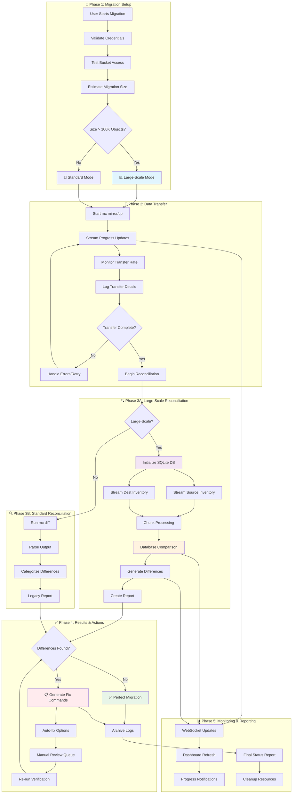
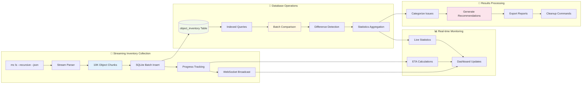
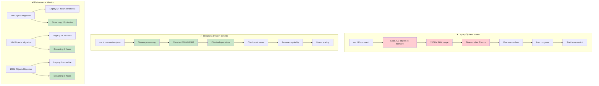
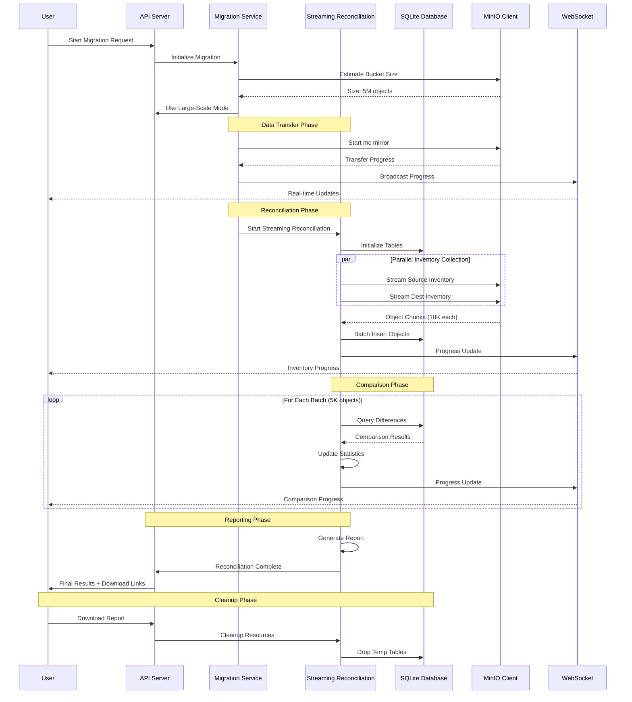
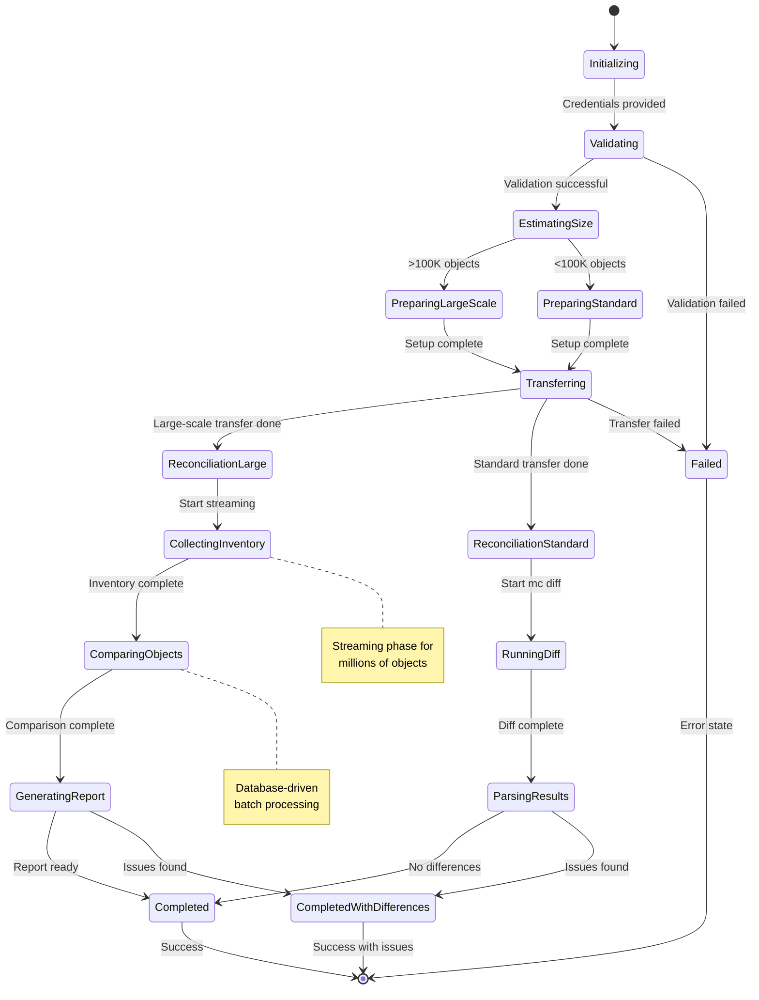
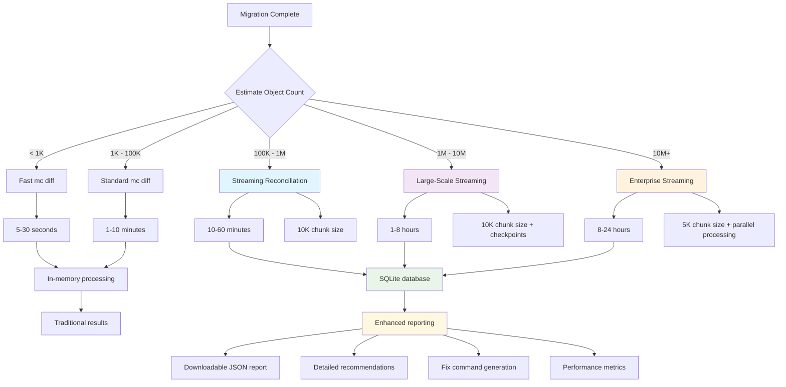
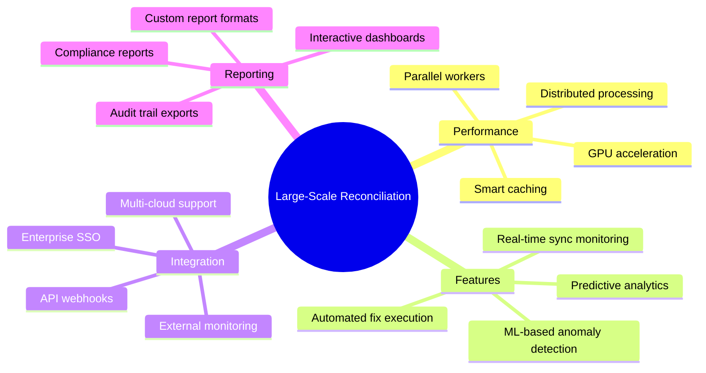

# 📊 S3 Migration Scheduler - Complete Workflow Diagrams

## 🔄 **Main Migration & Reconciliation Workflow**

---

## 🏗️ **Large-Scale Streaming Architecture**

---

## ⚡ **Performance Comparison: Legacy vs Streaming**

---

## 🛠️ **Technical Implementation Flow**

---

## 🔄 **State Machine: Migration Lifecycle**

---

## 🎯 **Reconciliation Decision Tree**

---

## 📈 **Scalability Matrix**

| Object Count | Strategy | Memory Usage | Time Estimate | Features |
|-------------|----------|--------------|---------------|----------|
| **< 1K** | Fast diff | 10MB | 30 seconds | Basic reporting |
| **1K - 100K** | Standard diff | 50MB | 5 minutes | Progress tracking |
| **100K - 1M** | Streaming | 100MB | 30 minutes | Database storage |
| **1M - 10M** | Large-scale | 200MB | 4 hours | Checkpoints + resume |
| **10M - 100M** | Enterprise | 500MB | 16 hours | Parallel processing |
| **100M+** | Extreme-scale | 1GB | 48+ hours | Distributed processing |

---

## 🚀 **Future Enhancements**

This comprehensive workflow system transforms the S3 Migration Scheduler from handling thousands of objects to efficiently managing **millions or even hundreds of millions** of objects with enterprise-grade reliability! 🌟